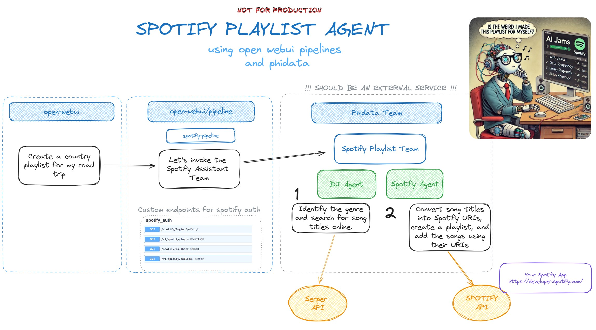

<div style="text-align: center;">
  
</div>



### Notes and Caveats

This project demonstrates a pipeline where the agent is implemented as an external service, located under the `services` folder of the pipeline project.

#### 1. External Service Integration

The Agent should be an external service.
For this demo is implemented under the services folder inside pipeline project.

#### 2. OpenWebUI User Settings

For user settings related to external services, the following workaround has been used:
[Open-Webui Pipelines Issue #168](https://github.com/open-webui/pipelines/issues/168).

#### 3. Spotify Auth Endpoints

In the case of an expired access token, the Spotify Toolkit returns the login URL to the LLM, allowing the user to simply click the link.

```python
       if e.response.status_code in [400, 401, 403]:
            return "Unauthorized access to Spotify. Use this link http://localhost:9099/spotify/login for retrieving a new access token."

```

To manage Spotify authentication, there are custom demo endpoints in the file `spotify_auth_routes.py` to update pipeline valves for Spotify access token. The file updates the pipeline FastAPI app routes, providing seamless integration and avoiding pipeline update conflicts (99% :P)
For more information on how I configured this repository [Repo Config](./RepoConfig.md).

`start.bat` file has been updated to start with `spotify_auth_routes.py`.

#### 4. TODO PERSISTENT MEMORY

## Start with OpenWebUI

To set up the OpenWebUI project, follow these steps:

1. **Clone the Repository:**  
   Cloning the project repository to your local machine:

2. **Create a Virtual Environment and Install Requirements:**  
   Create a virtual environment and install the necessary dependencies:

   ```bash
   python3 -m venv venv
   source venv/bin/activate  # On Windows: venv\Scripts\activate
   pip install -r requirements.txt
   ```

3. **Configure Environment Variables:**  
   Copy the `.env.example` file and rename it to `.env`. Set the following environment variables for the Spotify Assistant in your newly created `.env` file:

   ```bash
   SERPER_API_KEY= YOUR_SERPER_API_KEY
   MY_OPENAI_API_KEY= YOUR_OPENAI_API_KEY
   SPOTIFY_CLIENT_ID= .....
   SPOTIFY_CLIENT_SECRET= ...
   ```

   Ensure that you have registered your application with Spotify and obtained your client ID and client secret. When setting up your Spotify app, use `http://localhost:9099/spotify/callback` as the Redirect URI. For more details, refer to the [Spotify Developer Documentation](https://developer.spotify.com/documentation/web-api/).

   Additionally, you will need to acquire your SerpApi key. Please refer to the [SerpApi Documentation](https://serpapi.com/docs) for information on obtaining your API key.

4. **Run the Start Command:**  
   Finally, start the application by running the start command:

   ```bash
   ./start.bat  # On Windows
   ./start.sh   # On Unix-based systems
   ```

   The pipeline uses dependencies from the `phidata` package. This package should be automatically downloaded during the setup, even though it is not explicitly listed in the `requirements.txt` file.

   ```
   title: Spotify Pipeline
   author: nttluke
   date: 2024-09-30
   version: 1.0
   license: MIT
   description: A pipeline for creating spotify playlist
   requirements: phidata <------------- here
   ```

5. **Configure pipeline on OpenWebUI**

   For more details, refer to the [OpenWebUI Pipelines Documentation](https://docs.openwebui.com/pipelines/).

   After completing the configuration, you will see this:

   

   Now, feel free to ask for a playlist! 😉

   Hope you enjoy it.
